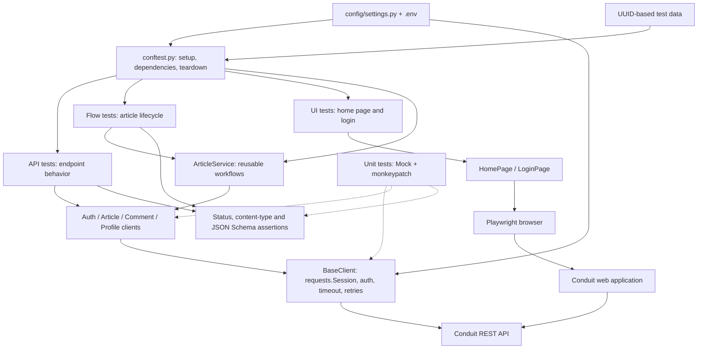
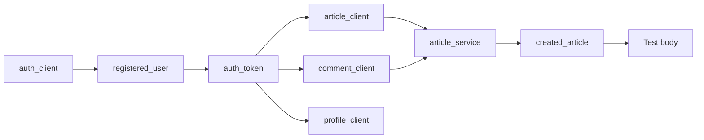

# Conduit API & UI Automation Framework

A Python/pytest automation framework for the RealWorld Conduit application. Most coverage runs through APIs; a small Playwright suite checks browser rendering and login. Isolated unit tests check the framework itself without calling a server.

## Architecture



Tests describe expected behavior. Domain clients translate Python calls into endpoint paths and payloads. `BaseClient` owns HTTP transport. Services combine endpoint calls into business workflows. Page objects encapsulate browser actions and locators. This separation keeps transport and selector changes out of most tests.

API tests can call clients directly; they do not have to pass through a service. The UI login test creates its user through the API before signing in through the browser.

## Project layout

```text
clients/         Shared HTTP transport and domain API clients
config/          Environment-based settings
pages/           Playwright page objects
schemas/         User, article, comment and error JSON schemas
services/        Reusable article workflows
utils/           Unique user and article data generation
validators/      HTTP status, content-type and schema assertions
tests/
  api/           Authentication, articles, comments and profiles
  flows/         Article lifecycle across multiple endpoints
  ui/            Home page and login browser checks
  unit/          Isolated transport, client and validator checks
conftest.py      Shared fixtures and UI collection hook
pytest.ini       Discovery, marker registration and logging
requirements.txt Python dependencies
.env.example     Example configuration; copy to local .env
```

`factories/` is currently empty; implemented data builders live in `utils/data_generator.py`.

## Setup

Use Python 3.10 or newer (the code uses modern union type annotations).

```bash
python3 -m venv venv
source venv/bin/activate
python -m pip install -r requirements.txt
cp .env.example .env

# Required only for browser tests
python -m playwright install chromium

# Start with tests that need no running application
python -m pytest tests/unit -q
```

On Windows PowerShell, activate with `venv\Scripts\Activate.ps1` and copy the configuration with `Copy-Item .env.example .env`.

Set `.env` to an accessible Conduit deployment before running API or UI tests. The example host is a configured default, not a guarantee that a public service is available. UI and API URLs must refer to the same application's data for the login test.

| Variable | Default | Purpose |
| --- | --- | --- |
| `BASE_URL` | `https://conduit-realworld-example-app.fly.dev/api` | API root, including `/api` |
| `UI_BASE_URL` | `BASE_URL` with trailing `/api` removed | Frontend root; `.env.example` sets it explicitly |
| `REQUEST_TIMEOUT` | `15` | Requests timeout in seconds |
| `TEST_PASSWORD` | `Test@123` | Password for generated test users |
| `RUN_UI_TESTS` | `false` | Enable browser tests when set to `true` |

`python-dotenv` loads `.env`; existing environment variables take precedence. Settings are read when the module is imported, so set variables before launching pytest. `.env` stays out of Git; `.env.example` contains example values for collaborators.

## Fixtures: dependency injection and resource lifecycle

A fixture is reusable setup requested by a test's argument name. Pytest resolves its dependencies automatically. Shared fixtures live in `conftest.py`, so test files do not import them.

```python
def test_get_article(article_client, created_article):
    response = article_client.get_article(created_article["slug"])
    assert response.status_code == 200
```

Here pytest creates an authenticated client and an article before invoking the test. All shared fixtures have **function scope** unless stated otherwise: each test gets fresh instances, while multiple requests for the same fixture within one test reuse its value.

| Fixture | What it supplies | Teardown |
| --- | --- | --- |
| `auth_client` | Unauthenticated `AuthClient` | Closes HTTP session |
| `registered_user` | Unique username, email, password and API token | No user deletion endpoint is available |
| `auth_token` | Token from `registered_user` | None |
| `article_client` | Authenticated `ArticleClient` | Closes HTTP session |
| `comment_client` | Authenticated `CommentClient` | Closes HTTP session |
| `profile_client` | Authenticated `ProfileClient` | Closes HTTP session |
| `anonymous_article_client` | Article client without an auth token | Closes HTTP session |
| `article_service` | Service using article and comment clients | No separate resource to close |
| `created_article` | Newly created article dictionary | Deletes by original slug; logs cleanup assertion failures |
| `second_registered_user` | Separate account for follow/feed scenarios | Closes its HTTP session; account remains |
| `ui_base_url` | Frontend URL; **session scope** | None |

The client fixtures share the same `auth_token` within a test, so article, comment and profile operations use the same user.



With a `yield` fixture, code before `yield` performs setup; the yielded value goes to the test; code after `yield` performs teardown. Pytest tears down dependent fixtures before their dependencies, allowing article deletion before client sessions close. Teardown runs after test failures when setup reached `yield`; a setup failure before `yield` does not execute that fixture's post-yield cleanup.

Additional fixtures come from pytest and plugins:

- `monkeypatch` temporarily replaces methods in unit tests and restores them afterward. Combined with `unittest.mock.Mock`, it verifies request construction without network calls.
- `page` comes from `pytest-playwright` and provides a browser page with plugin-managed browser/context lifecycle.

There are no custom `autouse` fixtures. Tests explicitly request the setup they need.

## Pytest markers and parametrization

Markers label tests so suites can be selected with `-m`. Registering a marker in `pytest.ini` does **not** automatically apply it to a directory or test.

| Marker | Current usage | Selection |
| --- | --- | --- |
| `smoke` | Register, valid login, create article, create comment | `python -m pytest -m smoke` |
| `negative` | Invalid login, duplicate email, unauthenticated create, missing article | `python -m pytest -m negative` |
| `integration` | Complete article lifecycle | `python -m pytest -m integration` |
| `ui` | Home page and browser login | `RUN_UI_TESTS=true python -m pytest -m ui` |
| `regression` | Registered but not currently applied | Use paths or the full suite today |
| `unit` | Registered but not currently applied | Use `python -m pytest tests/unit` today |

Many API tests are unmarked and still run in the default suite. UI tests currently have only `ui`, so `-m smoke` does not include them. `-m unit` and `-m regression` currently select no tests.

`@pytest.mark.parametrize("email,password", [...])` in `test_auth.py` runs invalid-login coverage separately for each credential pair. Parametrization generates cases; it is different from a suite label such as `negative`.

`pytest.ini` also configures:

- Discovery under `tests/`, using `test_*.py` files and `test_*` functions.
- `--strict-markers` to reject misspelled or unregistered custom markers.
- `-ra` to print a summary of non-passing outcomes.
- Live console logging at `INFO` level.

The `pytest_collection_modifyitems` hook marks UI tests as skipped unless `RUN_UI_TESTS=true`. Selecting `-m ui` alone does not enable them.

## Running tests

Run commands from the repository root with the virtual environment activated.

```bash
# No server or browser required
python -m pytest tests/unit -q

# API and workflow suites against the configured server
python -m pytest tests/api tests/flows

# All suites; UI tests are collected but skipped by default
python -m pytest

# Combine labels or select by test name
python -m pytest -m "smoke or negative"
python -m pytest tests/api -k favorite

# Inspect collected cases without executing them
python -m pytest --collect-only -q

# Parallel workers through pytest-xdist
python -m pytest tests/api -n auto

# HTML report through pytest-html
python -m pytest tests/unit --html=report.html --self-contained-html

# Browser checks: headless by default, visible with --headed
RUN_UI_TESTS=true python -m pytest tests/ui --browser chromium
RUN_UI_TESTS=true python -m pytest tests/ui --browser chromium --headed

# See HTTP method, URL and response-status debug logging
python -m pytest tests/api --log-cli-level=DEBUG
```

In PowerShell, enable UI tests with `$env:RUN_UI_TESTS="true"` before the pytest command. Parallel API runs create multiple accounts and resources; choose worker counts appropriate to your test deployment.

## Transport, assertions and test data

**HTTP transport:** `BaseClient` reuses a `requests.Session`, sets JSON headers, joins endpoint paths to the API root and applies a configurable timeout. Authentication uses `Authorization: Token <token>`. `set_token()` and `clear_token()` update the session header. Domain methods return the raw `requests.Response`, preserving status/body access for negative tests.

**Retries:** the mounted HTTP adapter configures three retries with a `0.5` backoff factor and status codes `502`, `503`, `504`. The allowed-method set is `GET`, `HEAD`, `OPTIONS`, limiting status/read retries to those methods. This is transport retry configuration, not pytest test reruns; connection retries can still occur before a request is sent. Mutating requests are not configured for status/read retries.

**Assertions:** `assert_status` accepts one status or a set and includes up to 1,000 response-body characters in a failure. `assert_json_content_type` checks the JSON content type. `assert_schema` wraps a Draft 7 JSON Schema validator, reporting the first validation error with its path. Schema checks cover response structure and types; tests separately check business values such as titles, authors, favorites and feed membership.

**Data:** UUID-derived suffixes produce distinct usernames, emails and article titles, reducing collisions between tests and parallel workers. Payload generators return ordinary dictionaries; there is no external data factory library.

**Workflow:** `ArticleService` creates articles, composes article-plus-comment creation, and deletes articles. Cleanup accepts `200`, `204` or `404`, allowing an already-absent article. The lifecycle test creates an article/comment, favorites and updates the article, verifies comments, then cleans up.

**UI:** `LoginPage` wraps navigation and sign-in fields; `HomePage` waits for Conduit text. Playwright's synchronous API supplies locators and waiting. Browser login uses an API-created account, avoiding UI registration setup.

## Coverage and current limitations

- API coverage includes auth, article CRUD-related behavior, pagination, author filtering, favorites, tags, comments, profiles, follow/unfollow and feeds.
- Unit coverage checks URL/timeout/token handling, domain payloads/endpoints, schema errors and status assertion messages. It does not exercise the full retry policy against a server.
- Users remain in the backend because this framework has no user-delete endpoint. Unique users prevent account reuse but do not remove test data.
- Cleanup is best effort in several paths. Failures before a cleanup block is entered may leave resources; article title updates may change the slug while the fixture still retains the original slug.
- `created_article` logs assertion failures during deletion; other exceptions can still fail teardown. Some direct cleanup calls do not validate deletion responses.
- Dependencies use minimum versions rather than a lockfile. No CI pipeline or automated test rerun plugin is configured.
- Generated HTML reports may include failure response bodies. Review reports before sharing them; they are excluded from version control.

## Extending the framework

1. Add a domain client under `clients/` using `BaseClient` for transport.
2. Define response contracts in `schemas/` and reuse validators in tests.
3. Add fixtures for setup and cleanup in `conftest.py`; keep mutable test data isolated.
4. Add a service when several tests need the same multi-endpoint workflow.
5. Add tests to the appropriate suite and apply registered markers explicitly.
6. Add a page object for new browser interactions and mark browser tests `ui`.
7. Run `tests/unit` after shared transport/client/validator changes, then relevant live suites.

For another product, the reusable concepts are transport, configuration, fixtures and validators; replace Conduit's clients, schemas, services and page objects with the new domain. This repository is an example framework, not a separately versioned shared-core package.

## Sharing and contributing

After cloning this repository, follow Setup and run the unit suite first. Each collaborator should keep their own local `.env` and choose the appropriate test deployment. Commit source, schemas, tests and example configuration; virtual environments, credentials, caches and generated reports are ignored.
